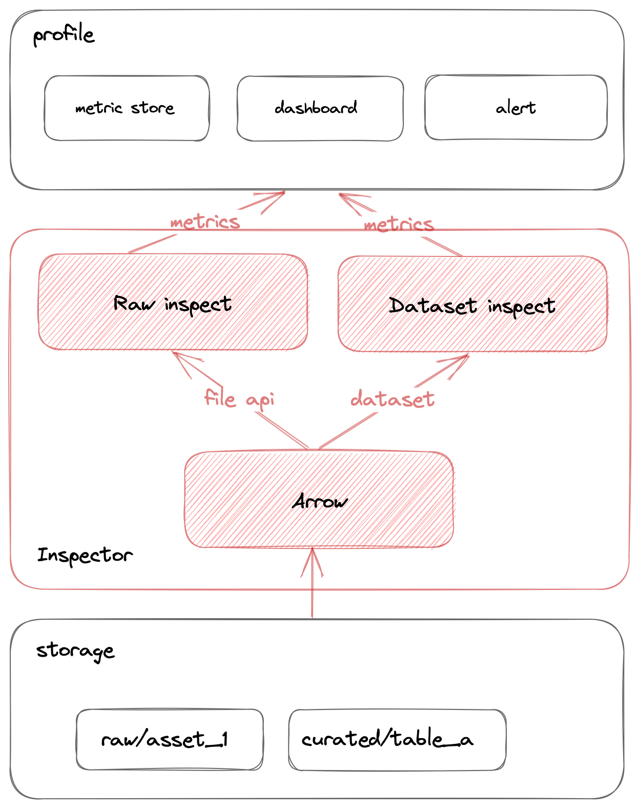

# Example:
- Inspect a path in S3:  
  - Make sure your s3 profile was set:
  ```
  export AWS_ENDPOINT_URL=
  export ACCESS_KEY=
  export AWS_SECRET_ACCESS_KEY=
  ```
  - Then run s3-inspect.py file:
  ```shell
  poetry run python s3-inspect.py lake-dev/dagster/test
  ```
-> Output to console
```
{'f1_partitions': ['lake-dev/dagster/test/date=20230315',
                   'lake-dev/dagster/test/date=20230316'],
 'latest_partition': ['date',
                      '20230316',
                      'lake-dev/dagster/test/date=20230316'],
 'number_of_files': 2,
 'path': 'lake-dev/dagster/test',
 'size': 23340}
```
  
- If you want to store metrics into file to S3:
```shell
poetry run python s3-inspect.py --writer s3 --write-uri lake-dev/inspector/metrics/test-dataset/$(date +%s).json lake-dev/dagster/test
```